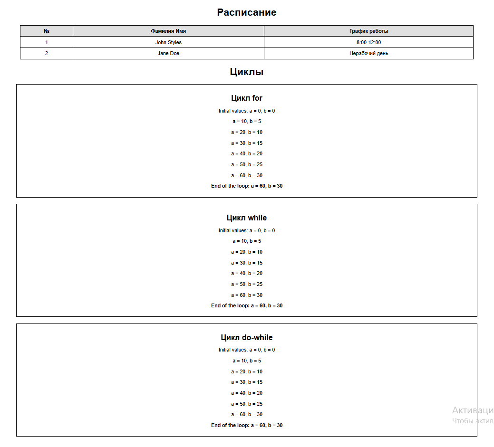

# Лабораторная работа №2

## Цель

Овладение навыками работы с условными конструкциями (`if`, тернарный оператор) и циклами (`for`, `while`, `do-while`) в PHP.

## Задание 1. Условные конструкции

### Использование функции `date()` для формирования расписания сотрудников на основе текущего дня недели.  

| №   | Фамилия Имя | График работы |
| --- | ----------- | ------------- |
| 1   | John Styles | xx - xx       |
| 2   | Jane Doe    | yy - yy       |

- Для `John Styles` (xx - xx):
  - Если текущий день недели — **понедельник, среда или пятница**, выведите график работы **8:00-12:00**.
  - В остальные дни недели выведите текст: **Нерабочий день**.
- Для `Jane Doe` (yy - yy):
  - Если текущий день недели — **вторник, четверг или суббота**, выведите график работы **12:00-16:00**.
  - В остальные дни недели выведите текст: **Нерабочий день**.

#### Часть кода

```php
<?php

$weekDay = date('l');

function getSchedule($weekDay, $employee) {
    if ($employee == 'John Styles') {
        if ($weekDay == 'Monday' || $weekDay == 'Wednesday' || $weekDay == 'Friday') {
            return '8:00-12:00';
        } else {
            return 'Нерабочий день';
        }
    } elseif ($employee == 'Jane Doe') {
        if ($weekDay == 'Tuesday' || $weekDay == 'Thursday' || $weekDay == 'Saturday') {
            return '12:00-16:00';
        } else {
            return 'Нерабочий день';
        }
    }
    return 'Ошибка: неизвестный сотрудник';
}

$employees = [
    ['1', 'John Styles', getSchedule($weekDay, 'John Styles')],
    ['2', 'Jane Doe', getSchedule($weekDay, 'Jane Doe')]
];

?>

```

#### Краткое пояснение

- `date('l')` получает текущий день недели.
- Функция `getSchedule($weekDay, $employee)` определяет рабочий график сотрудника в зависимости от дня недели.
- У каждого сотрудника `(John Styles и Jane Doe)` есть фиксированные рабочие дни и часы.
- Если текущий день не входит в список рабочих, возвращается `"Нерабочий день"`.
- Если передано неизвестное имя сотрудника, функция возвращает `"Ошибка: неизвестный сотрудник"`.
- Массив `$employees` содержит ID, имя и расписание сотрудников на текущий день.

---

## Задание 2. Циклы

1. Создайте файл `index.php` и реализуйте код:

```php
$a = 0;
$b = 0;

for ($i = 0; $i <= 5; $i++) {
   $a += 10;
   $b += 5;
   echo "a = $a, b = $b <br>";
}
```

2. Добавьте вывод промежуточных значений `$a` и `$b` на каждом шаге цикла.

3. Реализуйте аналогичный код с `while` и `do-while`:

```php
<h2>Цикл for</h2>

<?php
$a = 0;
$b = 0;

echo "<p>Initial values: a = $a, b = $b</p>";

for ($i = 0; $i <= 5; $i++) {
   $a += 10;
   $b += 5;
   echo "<p><b>End of the loop: a = $a, b = $b</b></p>";
}
?>
```

```php
<h2>Цикл while</h2>

    <?php
    $a = 0;
    $b = 0;
    $i = 0;
    echo "<p>Initial values: a = $a, b = $b</p>";

    while ($i <= 5) {
        $a += 10;
        $b += 5;
        echo "<p>a = $a, b = $b</p>";
        $i++;
    }

    echo "<p><b>End of the loop: a = $a, b = $b</b></p>";
    ?>
```

```php
<h2>Цикл do-while</h2>

    <?php
    $a = 0;
    $b = 0;
    $i = 0;
    echo "<p>Initial values: a = $a, b = $b</p>";

    do {
        $a += 10;
        $b += 5;
        echo "<p>a = $a, b = $b</p>";
        $i++;
    } while ($i <= 5);

    echo "<p><b>End of the loop: a = $a, b = $b</b></p>";
    ?>
```

---

Результат:



## Контрольные вопросы

**1. В чем разница между циклами for, while и do-while?**

 **`for`** – используется, когда **заранее известно**, сколько раз должен выполниться цикл. Например, если нужно вывести числа от 1 до 10.

 **`while`** – выполняется, пока условие **истинно**. Используется, когда **не знаем заранее**, сколько раз нужно повторять (например, ожидание ввода от пользователя).

 **`do-while`** – сначала выполняет код, а потом проверяет условие. Гарантированно выполняется **хотя бы один раз**, даже если условие изначально ложное.

**Когда какой использовать?**

- `for` – если точно знаем количество повторений.
- `while` – если не знаем, но есть условие.
- `do-while` – если код должен выполниться хотя бы один раз.
- `for` удобен, если известно количество итераций.
- `while` выполняется, пока истинно условие.
- `do-while` выполняет тело хотя бы один раз, даже если условие изначально ложно.

**2. Как работает тернарный оператор `? :` в PHP?**

Тернарный оператор — это короткая форма if-else, позволяющая записать условие в одной строке. Сначала проверяется условие, и если оно истинно, выполняется первое значение, иначе — второе.

```php
$условие ? $значение_если_истина : $значение_если_ложь;
```

Пример:

```php
$weather = "дождь";
$advice = ($weather == "дождь") ? "Возьми зонт!" : "Можно идти без зонта.";
echo $advice;
```

Как запомнить:
`условие ? если_истина : если_ложь;`
Если условие верно → берется первый вариант.
Если условие неверно → берется второй вариант.

**3. Что произойдет, если в do-while поставить условие, которое изначально ложно?**

Если в `do-while` условие сразу ложно, код внутри цикла **все равно выполнится хотя бы один раз**, а затем цикл завершится. Это главное отличие от `while`, где код вообще не выполнится, если условие ложно с самого начала.
Код выполнится один раз, а затем цикл завершится.

---

## Вывод

В ходе выполнения лабораторной работы были изучены и применены условные конструкции (`if`, тернарный оператор) и циклы (`for`, `while`, `do-while`) в PHP. Было реализовано динамическое расписание сотрудников на основе текущего дня недели, а также продемонстрирована работа циклов с пошаговым изменением значений переменных. Данная работа позволила закрепить понимание логики выполнения управляющих конструкций в PHP и их практическое применение в разработке веб-приложений. В ходе лабораторной работы освоены условные конструкции и циклы в PHP. Реализовано динамическое расписание сотрудников с `date()`, а также продемонстрирована работа трех типов циклов с выводом промежуточных значений.

## Библиография

1. Официальная документация PHP: [https://www.php.net/manual/ru/](https://www.php.net/manual/ru/)
2. Работа с циклами в PHP: [https://www.php.net/manual/ru/control-structures.for.php](https://www.php.net/manual/ru/control-structures.for.php)
3. Функция date() в PHP: [https://www.php.net/manual/ru/function.date.php](https://www.php.net/manual/ru/function.date.php)
